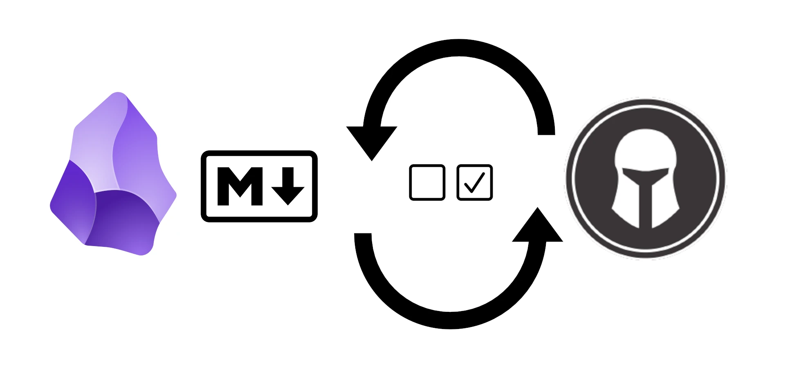

# README




This set of scripts is to synchronise the tasks between tasks in your markdown files (added using [obsidian tasks plugin](https://github.com/obsidian-tasks-group/obsidian-tasks) typically) and taskwarrior.
It will extract tasks in markdown files, import them in taskwarrior, and later keep markdown files up-to-date when modified in taskwarrior.

Technically : it is written in bash and parses or modifies directly the markdown files without requiring obsidian. To keep track between original file and taskwarrior it relies on UUID that are added to tasks.

For example in your markdown file a task like following is modified from :
```markdown
- [ ] feed the cat
```
to

```markdown
- [ ] feed the cat [id:: eb48e204-e8be-416b-857d-8154edbbd7ad]
```

and then when you mark it completed in taskwarrior, it is updated to

```markdown
- [x] feed the cat [id:: eb48e204-e8be-416b-857d-8154edbbd7ad]
```

Once imported in your taskwarrior, tasks will have annotation like :

```text
ID Age   Project    Description                                                                                                                                        Urg
25  3d   perso      feed the cat                                                                                                        11.7
                      2025-03-31 Source: /Users/nbossard/Agenda/2025-03-28.md
```

Note that the original file is in annotation and can be opened easily using taskopen. See [taskopen configuration below](#taskopen-configuration)

## External dependencies :

To work correctly it requires following external program to be available on your computer :

- [ripgrep](https://github.com/BurntSushi/ripgrep), for speed
- sed
- awk
- and of course [taskwarrior](https://taskwarrior.org/) v3 or more

## installation

### create aliases

Git clone this repo and add aliases to bash scripts like following:

```bash
alias mtt_taskwarrior_to_md="~/folder-you-cloned/obsidian-taskwarrior-sync/mtt_taskwarrior_to_md.sh"
alias mtt_md_to_taskwarrior="~/folder-you-cloned/obsidian-taskwarrior-sync/mtt_md_to_taskwarrior.sh"
alias mtt_md_add_uuids="~/folder-you-cloned/obsidian-taskwarrior-sync/mtt_md_add_uuids.sh"
alias mtt_sync="~/folder-you-cloned/obsidian-taskwarrior-sync/mtt_sync.sh"
```

### hooks

Hooks are used when tasks are modified in taskwarrior to modify original markdown files they were extracted from.

Create a file named "on-modify.obsidian-sync" in folder "~/.task/hooks" with content like :
```
#!/bin/bash
read -r OLD
read -r NEW
~/folder-you-cloned/obsidian-taskwarrior-sync/mtt_taskwarrior_to_md.sh --task "$NEW"
echo "$NEW"
```

...and make it executable with `chmod u+x ~/.task/hooks/on-modify.obsidian-sync`

## usage

under the hood way of working:

- adding uuids to obsidian tasks
- generating import file
- import file into taskwarrior

### import obsidian tasks into taskwarrior

#### All-in-one script

Just call mtt_sync script that will do it all for you.

```bash
mtt_sync
```

Sample real-life call : ` mtt_sync --mask "documentation/Agenda/*.md" --project paymetrics`

#### more low level

```bash
## Add uuids to all tasks
## This will modify your markdown files.
mtt_add_uuids
# generate a file tasks.ndjson
mtt_md_to_taskwarrior
task import tasks.ndjson
```

### automatically update obsidian when taskwarrior tasks are updated

Using obsidian hooks, script mtt_taskwarrior_to_md.sh is called automatically.

## conversion choices

Only active tasks are synchronised.

| markdown (obsidian-tasks)| taskwarrior | ref docs |
| ------------- | ----------- | --- |
| start         | wait        | https://publish.obsidian.md/tasks/Getting+Started/Dates#Start%20date https://taskwarrior.org/docs/task/ |
| dependsOn     | depends     | |
| #toto         | tag "toto"  |
| priority:highest | uda.priority=H | |
| priority:high | uda.priority=H | |
| priority:low | uda.priority=L | |
| priority:lowest | uda.priority=L | |

Please also note that status deleted in taskwarrior is marked as canceled [-] in markdown.

## Taskopen configuration

[taskopen](https://github.com/jschlatow/taskopen) is a taskwarrior to interact easily with tasks annotations.
We can use it to easily open task original source file.

Sample of additional config for taskopen for defining an action to open original source file in obsidian repo named "perso":

```ini
[Actions]
# new additional action, tested on macos, please adapt command to other OS
obsidianopenperso.target=annotations
obsidianopenperso.labelregex="^Source.*"
obsidianopenperso.regex="^.*perso(.*\\.md)"
obsidianopenperso.command="open \"obsidian://open?vault=perso&file=$LAST_MATCH\""
obsidianopenperso.modes="batch,any,normal"

# you may also need to change "file action" following line
files.labelregex="(?!.*Source).*"
```

## tests

If this readme is not clear enough, tests can help you understand expected program behaviour, they are written to be very easy to read for non technical persons.
Please refer to [tests](./tests/README.md) folder

## reference documentations

taskwarrior import format : <https://github.com/GothenburgBitFactory/taskwarrior/blob/develop/doc/devel/rfcs/task.md>

taskwarrior hooks: <https://taskwarrior.org/docs/hooks/>

Obsidian-tasks plugin : <https://github.com/obsidian-tasks-group/obsidian-tasks>
